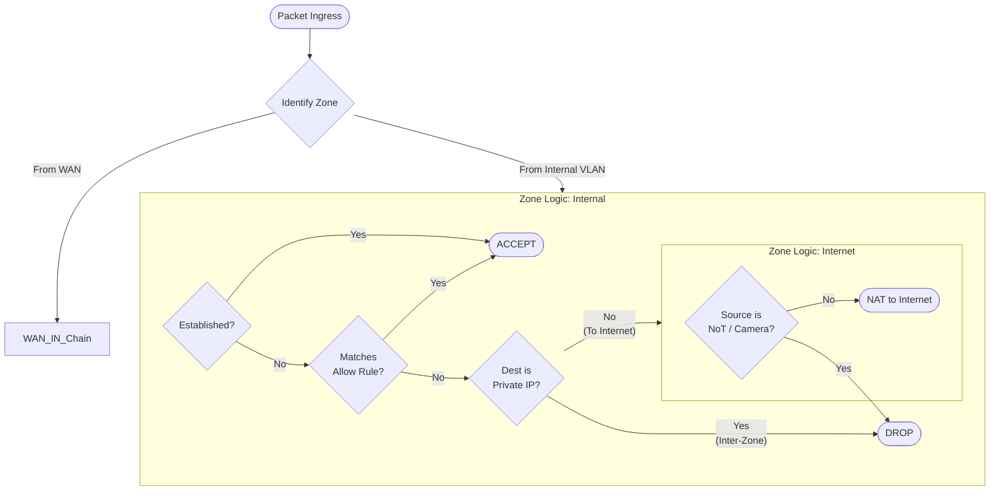

# Firewall & Security Policies

## Description
This document outlines the security posture enforced by the Edge Gateway
(UDM-Pro). The firewall logic is built on a **Stateful Packet Inspection (SPI)**
model utilizing a **Zone-Based** architecture to strictly control traffic
between network segments.

## Terminology & Logic Map
The UDM-Pro enforces rules based on traffic direction between Zones. In the
UniFi interface, these are configured under the Firewall section.

| Logical Zone   | UniFi Rule Type / Zone | Description                                                                                         |
| :---           | :---                   | :---                                                                                                |
| **LAN Zone**   | `LAN IN`               | Traffic entering the gateway from an internal VLAN (e.g., IoT -> Server). **Most rules live here.** |
| **WAN Zone**   | `WAN OUT` / `Internet` | Traffic leaving the gateway towards the Internet.                                                   |
| **Local Zone** | `LAN LOCAL`            | Traffic destined for the Gateway itself (SSH, DNS, Web UI).                                         |
| **Guest Zone** | `GUEST IN`             | Traffic from Guest VLANs (usually pre-isolated).                                                    |

## Global Security Settings
Before individual zone rules are applied, global threat management protections
are enforced at the network edge.

* **IDS/IPS (Intrusion Prevention System):** Enabled on High Sensitivity.
  * *Action:* Detect and Block.
  * *Categories:* Malware, P2P, Tor, SQL Injection, Shellcode.
* **Geo-Blocking:** Traffic is strictly blocked to/from high-risk countries with
  no legitimate business requirement.
* **Content Filtering:** DNS-based filtering is applied per Zone (e.g., Kids,
  Guest) via "Traffic Rules".

## Firewall Rule Hierarchy (Zone: LAN / Internal)
The core segmentation logic resides in the internal zone traffic (`LAN IN`).
Rules are processed in top-down order (First Match).

1.  **Allow Established/Related:** (Priority: High)
    * **Action:** Allow
    * *Reasoning:* Ensures return traffic for valid connections is not dropped.
2.  **Allow Critical Infrastructure:**
    * **Source:** All Zones (except Guest)
    * **Destination:** Server VLAN (Port 53/DNS, 123/NTP)
    * **Action:** Allow
3.  **Allow Management Access:**
    * **Source:** Main Zone (VLAN 10)
    * **Destination:** Management Zone (VLAN 1)
    * **Action:** Allow (SSH/HTTPS)
4.  **Allow Home Assistant Polling:**
    * **Source:** Server Zone (Home Assistant IP)
    * **Destination:** IoT / NoT Zones
    * **Action:** Allow
5.  **BLOCK Inter-VLAN Routing (The "Golden Rule"):**
    * **Source:** RFC1918_Subnets (Any Private IP)
    * **Destination:** RFC1918_Subnets (Any Private IP)
    * **Action:** **DROP**
    * *Effect:* This catch-all rule enforces isolation. If traffic wasn't
      explicitly allowed in steps 1-4, it is blocked here.

## Egress Filtering (Zone: WAN / Internet)
To prevent data exfiltration or "phone home" behavior, specific zones are
restricted from accessing the internet.

* **NoT Zone (VLAN 35):** DROP all traffic to WAN.
* **Camera Zone (VLAN 40):** DROP all traffic to WAN.
* **Dummy Zone (VLAN 99):** DROP all traffic.

## Object Groups
To maintain clean rules, IP addresses are grouped into logical objects.

| Group Name          | Type               | Description                                                                                                         |
| :---                | :---               | :---                                                                                                                |
| **RFC1918_Subnets** | IPv4 Address Group | Defines all private IP ranges (`10.0.0.0/8`, `172.16.0.0/12`, `192.168.0.0/16`). Used to define "Internal Traffic". |
| **Core_Servers**    | IPv4 Address Group | DNS (PiHole), NTP, and Auth servers.                                                                                |

## Traffic Flow Visualization

The diagram illustrates the decision logic when a packet traverses the Zones.

## Transparency Note

The architecture and implementation detailed in this repository are 100% manual
and self-hosted. However, AI tools have been leveraged to refine the
documentation's structure and language to ensure readability.
