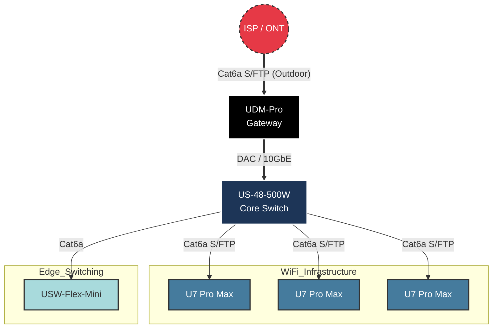

# Physical Infrastructure & Hardware

## Description

This document details the physical layer (Layer 1) of the home lab, including
hardware specifications, cabling standards, and the ISP demarcation point. The
infrastructure is designed to support high-speed wireless standards (WiFi 7) and
utilizes a 10Gbps backbone for inter-VLAN routing.

## Hardware Inventory

| Device            | Model                  | Role                    | Key Specs                               |
| :---              | :---                   | :---                    | :---                                    |
| **Gateway**       | Ubiquiti UDM-Pro       | Router / Firewall / NVR | 10G SFP+ WAN/LAN, IPS/IDS enabled       |
| **Core Switch**   | Ubiquiti US-48-500W    | Core Access Switch      | 48x 1GbE PoE+, 2x 10G SFP+, 500W Budget |
| **Access Points** | 3x Ubiquiti U7 Pro Max | Wireless Access         | WiFi 7 (6GHz), 4x4 MIMO                 |
| **Edge Switch**   | Ubiquiti USW-Flex-Mini | Desk/Media Switch       | 5x 1GbE, USB-C/PoE powered              |

*\> Note: The U7 Pro Max access points are currently linked at 1Gbps due to the
port limitations of the US-48-500W switch.*

## ISP & WAN Circuit

The internet connection is delivered via Fiber-to-the-Home (FTTH).

* **Service:** 500/500 Mbps (Infrastructure supports 1000/1000).
* **Demarcation Point (ONT):** Wall-mounted media converter on the ground floor.
* **Feeder Cable:** Due to architectural constraints, the link from the ONT to
  the Server Rack (located in the attic) is routed partly outdoors.
* **Cable Spec:** **Cat6a S/FTP (Outdoor Rated)** is utilized for this run to
  withstand the harsh Nordic climate and shield against interference along the
  path.

## Cabling Standards

Cabling is standardized based on environmental exposure and interference risks.

### Backbone (Core-to-Router)

* **Type:** 10G Passive DAC (Direct Attach Copper) SFP+
* **Speed:** 10 Gbps
* **Purpose:** Provides a non-blocking high-bandwidth uplink between the Router
  and the Core Switch to prevent bottlenecks during Inter-VLAN routing.

### Wireless Uplinks & WAN

* **Type:** Cat6a S/FTP (Shielded Foiled Twisted Pair)
* **Purpose:** Used for the WAN feed and Access Points. The shielding protects
  against EMI (Electromagnetic Interference) and crosstalk, which is critical
  for maintaining stable PoE++ delivery to the U7 Access Points and data
  integrity over longer runs.

### General Access

* **Type:** Cat6a U/UTP
* **Purpose:** Standard patch cabling for rack interconnects and general
  clients (Flex Mini).

## Physical Topology

The diagram illustrates the physical interconnects and media types.

## Transparency Note

The architecture and implementation detailed in this repository are 100% manual
and self-hosted. However, AI tools have been leveraged to refine the
documentation's structure and language to ensure readability.
