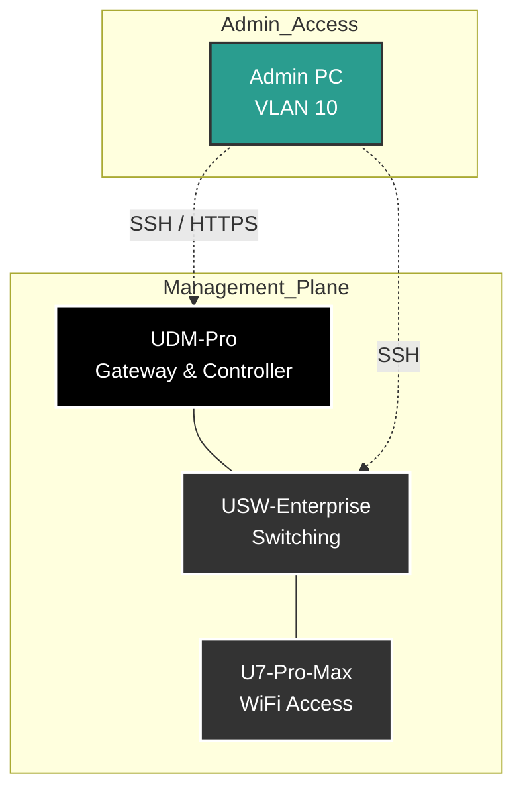

# VLAN 01 - Management (Default)

## Description
The Management VLAN is the critical control plane for the entire network
infrastructure. It hosts the network appliances themselves (Router, Switches,
Access Points) and the Controller interfaces.

## Design Philosophy
* **Infrastructure Only:** No client devices (phones, laptops, servers) reside
  here. Only network equipment is allowed.
* **Untagged Default:** Following UniFi best practices, this is the
  native/untagged VLAN on trunk ports to ensure seamless adoption and
  provisioning of new UniFi hardware.
* **Access Control:** Access to the management interfaces (SSH/HTTPS) of
  devices on this VLAN is strictly limited to the Admin (Main) VLAN.

## Security Posture
* **Strict Ingress:** Only the Main VLAN (VLAN 10) can initiate management
  connections (SSH port 22, HTTPS port 443).
* **Internet Access:** Network devices are allowed outbound access strictly for
  firmware updates and NTP synchronization.
* **DHCP Guarding:** Trusted DHCP is enforced to prevent rogue DHCP servers
  from hijacking the management plane.

## IP Address Management (IPAM) Schema

| IP-Range (Host) | Zone / Purpose    | Description                       | Examples             |
| :---            | :---              | :---                              | :---                 |
| **.1**          | Network & Gateway | Default Gateway (UDM-Pro)         | `udm-pro.mgmt`       |
| **.2 - .9**     | Core Switching    | Aggregation / Core Switches       | `usw-agg.mgmt`       |
| **.10 - .19**   | Access Switching  | Edge Switches                     | `usw-flex.mgmt`      |
| **.20 - .49**   | Access Points     | Wireless Access Points            | `u7-pro-max-01.mgmt` |
| **.50 - .254**  | DHCP Pool         | Provisioning pool for new devices |                      |

## Network Topology Visualization

This schematic shows the "Control Plane" hierarchy.

## Transparency Note

The architecture and implementation detailed in this repository are 100% manual
and self-hosted. However, AI tools have been leveraged to refine the
documentation's structure and language to ensure readability.
