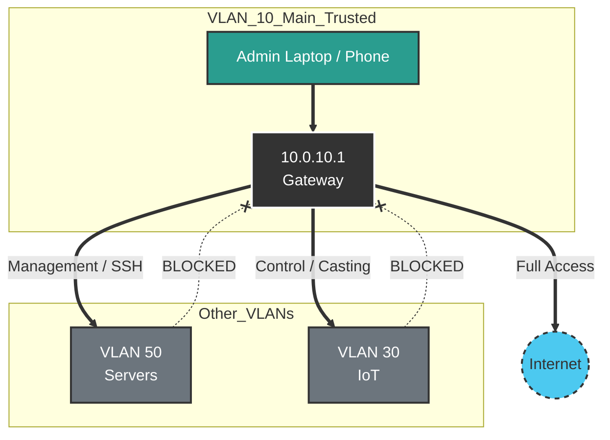

# VLAN 10 - Main (Trusted)

## Description
The "Main" network is the highest-trust zone in the environment, designated for
personal devices owned by the household administrators (Laptops, Smartphones,
Tablets). Devices here have the broadest access privileges.

## Design Philosophy
* **Privileged Access:** Unlike other segments, the Main VLAN acts as the
  "Management Plane" for the home. Devices here can initiate connections to
  Servers, IoT, and Camera streams.
* **Performance:** High-performance devices utilizing WiFi 6E/7 (6GHz) reside
  here to maximize throughput for daily tasks and media consumption.
* **Security:** While trusted, this network is protected from *inbound* traffic
  initiated by compromised IoT or Guest devices.

## Security Posture
* **Outbound Policy:** Unrestricted access to WAN and all local VLANs (Servers,
  IoT, Cameras).
* **Inbound Policy:** **Stateful Only**. No other VLAN can initiate a
  connection to the Main VLAN. Return traffic from established connections is
  allowed.
* **DNS:** Uses standard encrypted DNS (DoH/DoT) via PiHole for ad-blocking
  without restrictive content filtering.

## IP Address Management (IPAM) Schema

| IP-Range (Host) | Zone / Purpose         | Description                                  | Examples         |
| :---            | :---                   | :---                                         | :---             |
| **.1**          | Network & Gateway      | Default Gateway (UDM-Pro)                    | `gw-vlan10.main` |
| **.2 - .100**   | Fixed Personal Devices | Desktops, Primary Laptops (Static mappings)  | `admin-pc`       |
| **.100 - .254** | DHCP Pool              | Mobile devices, Tablets, Wearables           |                  |

## Network Topology Visualization

The diagram illustrates the **One-Way Trust** model. The Main VLAN can
"reach down" into other segments, but they cannot "reach up".

## Transparency Note

The architecture and implementation detailed in this repository are 100% manual
and self-hosted. However, AI tools have been leveraged to refine the
documentation's structure and language to ensure readability.
