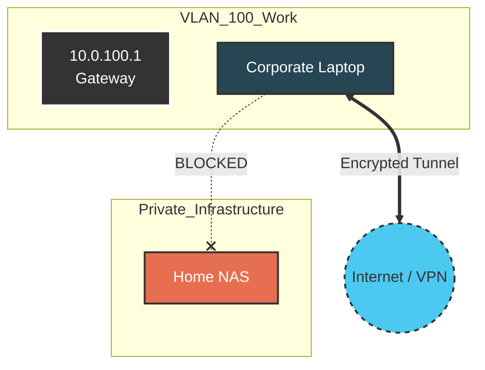

# VLAN 100 - Work

## Description
This network segment is dedicated to corporate assets (laptops, phones)
provided by employers. It serves two main purposes: prioritizing traffic for
remote work (VoIP/Video) and isolating corporate telemetry from private home
data.

## Design Philosophy
* **Data Privacy:** Corporate devices often have monitoring agents (EDR/MDM)
  capable of scanning local subnets. By isolating this VLAN, personal data on
  the Server/NAS VLANs remains invisible to employer monitoring tools.
* **QoS Priority:** Traffic originating from this VLAN (specifically
  Zoom/Teams/VPN traffic) is prioritized in the UDM-Pro Smart Queues to ensure
  call quality even during high home bandwidth usage.
* **VPN Compatibility:** The subnet is sized and routed to avoid IP overlap
  conflicts with common corporate VPN ranges (avoiding standard 192.168.0.x/1.x
  subnets).

## Security Posture
* **Outbound:** Unrestricted Internet access (often tunneled via corporate VPN).
* **Inbound:** Blocked.
* **Local LAN:** **Strictly Blocked**. A corporate laptop cannot access the
  home NAS, IoT devices, or cameras. This is a "Guest-like" isolation policy
  but with higher QoS priority.

## IP Address Management (IPAM) Schema

| IP-Range (Host) | Zone / Purpose     | Description                    | Examples          |
| :---            | :---               | :---                           | :---              |
| **.1**          | Network & Gateway  | Default Gateway (UDM-Pro)      | `gw-vlan100.work` |
| **.10 - .49**   | Fixed Workstations | Docking stations / Desktop PCs | `work-dock-01`    |
| **.50 - .254**  | DHCP Pool          | Laptops, Test devices          |                   |

## Network Topology Visualization

The diagram illustrates the isolation barrier protecting the Personal Cloud
from the Corporate Device.

## Transparency Note

The architecture and implementation detailed in this repository are 100% manual
and self-hosted. However, AI tools have been leveraged to refine the
documentation's structure and language to ensure readability.
