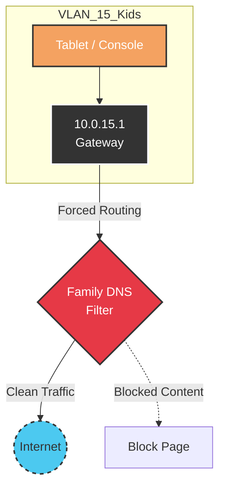

# VLAN 15 - Kids

## Description
This segment is dedicated to devices used by minors in the household. The
primary focus is providing a safe, filtered online experience with automated
usage limits.

## Design Philosophy
* **Safety First:** DNS requests are intercepted and forced through a specific
  content-filtering provider (e.g., Cloudflare Family or AdGuard Family) to
  block adult content and malware.
* **Scheduling:** Internet access is programmatically disabled during night
hours via UDM-Pro Traffic Rules or Home Assistant integrations.
* **Isolation:** Kids' devices are isolated from the Server and Work networks
to prevent accidental disruption of critical services.

## Security Posture
* **Content Filtering:** DNS Sinkholing is enforced. Attempts to bypass local
  DNS (e.g., manually setting 8.8.8.8) are blocked by firewall rules (Port 53
  redirect).
* **Inter-VLAN:** Blocked. No access to Servers, Cameras, or IoT controls.
* **Time-Based Access:** WiFi SSID is scheduled to disable radio broadcasting
  at designated bedtimes.

## IP Address Management (IPAM) Schema

| IP-Range (Host) | Zone / Purpose    | Description                                    | Examples                                             |
| :-------------- | :---------------- | :--------------------------------------------- | :--------------------------------------------------- |
| **.1**          | Network & Gateway | Default Gateway (UDM-Pro)                      | `gw-vlan15.int.vollbro.se`                           |
| **.10 - .49**   | Fixed Devices     | Gaming Consoles, School PCs (Static for rules) | `ps5-console.int.vollbro.se`, `pc-01.int.vollbro.se` |
| **.50 - .254**  | DHCP Pool         | Phones, Tablets, Handhelds                     |                                                      |

## Network Topology Visualization

This schematic highlights the **DNS Interception** layer, showing that traffic
is filtered before reaching the internet.

## Transparency Note

The architecture and implementation detailed in this repository are 100% manual
and self-hosted. However, AI tools have been leveraged to refine the
documentation's structure and language to ensure readability.
