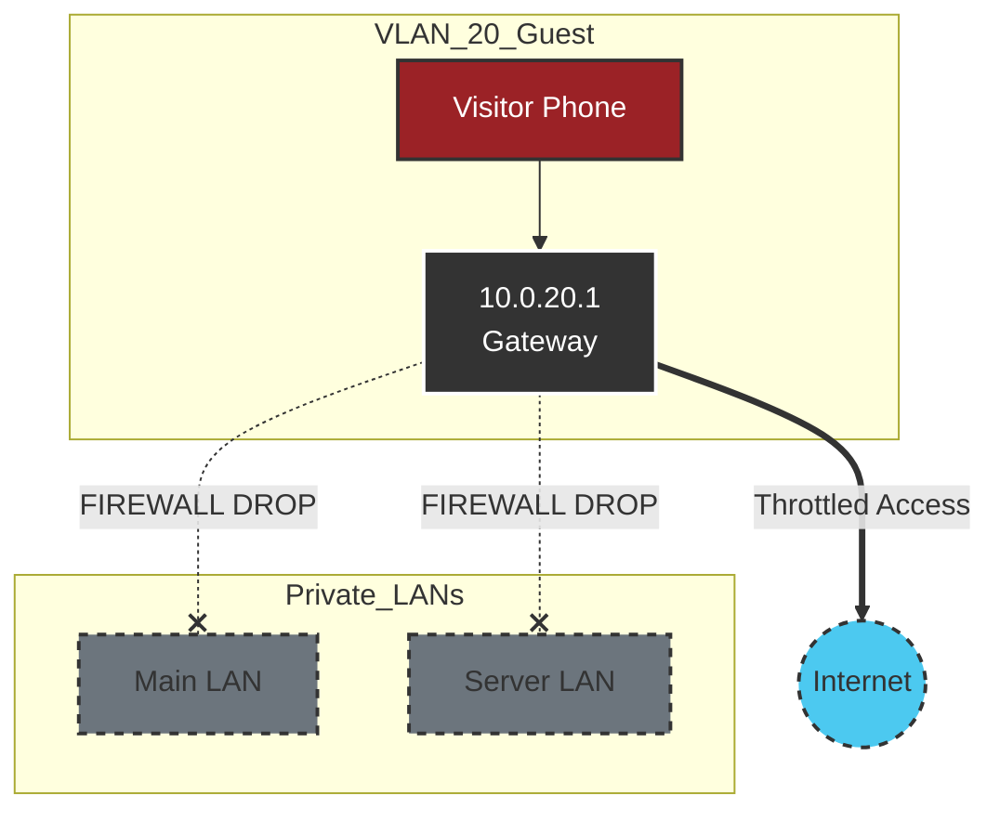

# VLAN 20 - Guest

## Description
The Guest network provides internet access for visitors without compromising
the security of the private home infrastructure. It is designed to be ephemeral
and strictly isolated.

## Design Philosophy
* **Ephemeral Access:** Devices are not expected to remain on this network
  permanently. DHCP lease times are short (e.g., 1-4 hours) to reclaim
  resources.
* **Total Isolation:** "Client Device Isolation" is enabled, preventing guest
  devices from communicating even with each other (protecting guests from other
  guests).
* **Simplicity:** No access to internal services (Plex, Home Assistant,
  Printers) is granted by default.

## Security Posture
* **Access Control:** WPA2/3 Personal authentication (or Captive Portal).
* **Local LAN:** **Strictly Blocked**. Firewall rules drop all traffic to
  RFC1918 subnets (10.0.0.0/8, 192.168.0.0/16).
* **Bandwidth Limiting:** Quality of Service (QoS) rules (Smart Queues) ensure
  guest traffic does not saturate the WAN link.

## IP Address Management (IPAM) Schema

| IP-Range (Host) | Zone / Purpose    | Description                      | Examples          |
| :---            | :---              | :---                             | :---              |
| **.1**          | Network & Gateway | Default Gateway (UDM-Pro)        | `gw-vlan20.guest` |
| **.2 - .254**   | DHCP Pool         | Dynamic allocation (Short Lease) |                   |

## Network Topology Visualization

The simplest topology in the stack: A direct pipe to the internet with solid
walls on all other sides.

## Transparency Note

The architecture and implementation detailed in this repository are 100% manual
and self-hosted. However, AI tools have been leveraged to refine the
documentation's structure and language to ensure readability.
