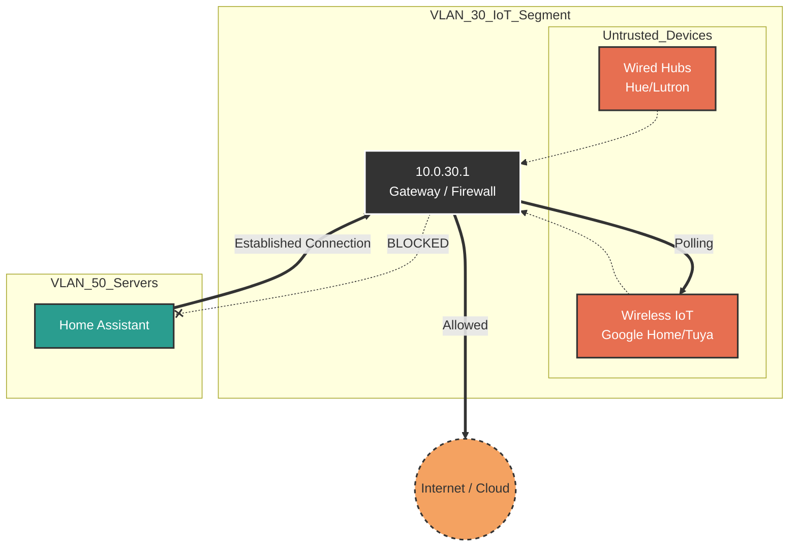

# VLAN 30 - IoT (Internet of Things)

## Description

This network segment hosts untrusted "smart" devices that require internet
connectivity to function (e.g., voice assistants, smart appliances, media
players). These devices are treated as potential security risks and are
isolated from the core network.

## Design Philosophy

Unlike the Server VLAN (VLAN 50), which relies on static addressing and trust,
the IoT VLAN operates on a **Zero Trust** basis.

* **Untrusted by Default:** All devices on this network are assumed to be
compromised or vulnerable.
* **Internet Access:** Allowed (unlike the NoT/VLAN 35 segment), as these
devices rely on cloud APIs.
* **Isolation:** Strict firewall rules prevent lateral movement. An IoT device
cannot initiate a connection to the Server or Main LAN.
* **mDNS / Discovery:** Since IoT devices often rely on multicast for discovery
(e.g., Casting), **mDNS Reflection** is configured on the UDM-Pro to allow
specific cross-VLAN discovery without opening full network access.

## Security Posture

* **Client Device Isolation:** Enabled at the Access Point level (Layer 2).
Devices on this VLAN cannot communicate with each other directly to prevent
worm-like propagation of malware.
* **Firewall Rules (Layer 3):**
  * **Inbound:** Blocked from all networks.
  * **Outbound:** Allowed to WAN (Internet).
  * **Local LAN:** Blocked (RFC1918 addresses). Specific pinholes are opened
  only for Home Assistant to poll devices (Stateful inspection allows return
  traffic).

## IP Address Management (IPAM) Schema

Since IoT environments are dynamic, the IPAM strategy prioritizes a large DHCP
pool over static reservations.

| IP-Range (Host) | Zone / Purpose         | Description                                          | Examples                |
| :---            | :---                   | :---                                                 | :---                    |
| **.1**          | Network & Gateway      | Default Gateway (UDM-Pro)                            | `gw-vlan30.iot`         |
| **.2 - .9**     | Infrastructure         | Reserved for IoT-specific Bridges/Hubs (Wired)       | `hue-bridge`, `tradfri` |
| **.10 - .49**   | Fixed IoT (Static/Res) | Critical IoT devices requiring fixed IPs for polling | `unifi-doorbell`        |
| **.50 - .254**  | DHCP Pool              | Dynamic assignment for WiFi devices                  | *Google Home, Roborock* |

## Network Topology Visualization

The schematic highlights the **Isolation** aspect. Note how IoT devices can
reach the Cloud, but are blocked from the Secure LAN/Servers.

## Transparency Note

The architecture and implementation detailed in this repository are 100% manual
and self-hosted. However, AI tools have been leveraged to refine the
documentation's structure and language to ensure readability.
