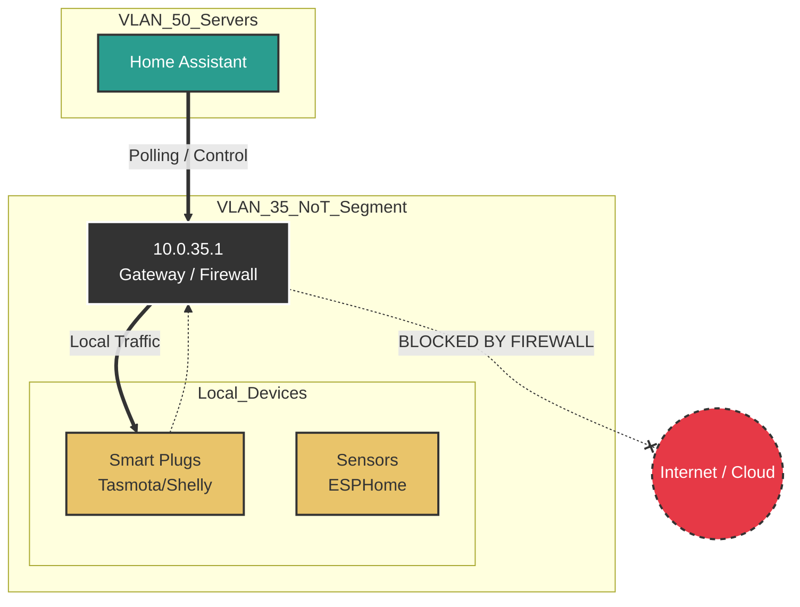

# VLAN 35 - NoT (Network of Things)

## Description
The "NoT" (Network of Things) segment is a strictly isolated network for smart
devices that do not require internet access to function. This typically
includes local-only sensors, smart plugs, and Zigbee/Z-Wave bridges.

## Design Philosophy
While VLAN 30 (IoT) adopts a "Zero Trust" model with internet access, VLAN 35
enforces a **"Private by Design"** philosophy.

* **Air-gapped Logic:** Devices here are logically prevented from communicating
with the Internet (WAN). This eliminates the risk of firmware backdoors
"phoning home" or data exfiltration to cloud providers.
* **Local Control Only:** All control is mediated through a central automation
controller (Home Assistant) located in the Server VLAN.
* **Stability:** By isolating these devices, they are unaffected by internet
outages or cloud service deprecations.

## Security Posture
* **WAN Access:** **Strictly Blocked**. Firewall rules drop all traffic destined
for non-RFC1918 addresses.
* **Inter-VLAN:** Blocked. Devices cannot initiate connections to other VLANs.
* **Exceptions:** The Home Assistant server (VLAN 50) is explicitly allowed to
initiate connections *inbound* to this VLAN for polling/control (Stateful
firewall allows the return traffic).

## IP Address Management (IPAM) Schema

| IP-Range (Host) | Zone / Purpose          | Description                                  | Examples           |
| :---            | :---                    | :---                                         | :---               |
| **.1**          | Network & Gateway       | Default Gateway (UDM-Pro)                    | `gw-vlan35.not`    |
| **.10 - .49**   | Infrastructure / Bridges| Hubs requiring fixed IPs (e.g., Hue, Lutron) | `hue-bridge-local` |
| **.50 - .254**  | DHCP Pool               | WiFi Smart Plugs, Tasmota/ESPHome devices    |                    |

## Network Topology Visualization

The schematic illustrates the **Hard Block** to the internet, contrasting with
the standard IoT network.

## Transparency Note

The architecture and implementation detailed in this repository are 100% manual
and self-hosted. However, AI tools have been leveraged to refine the
documentation's structure and language to ensure readability.
