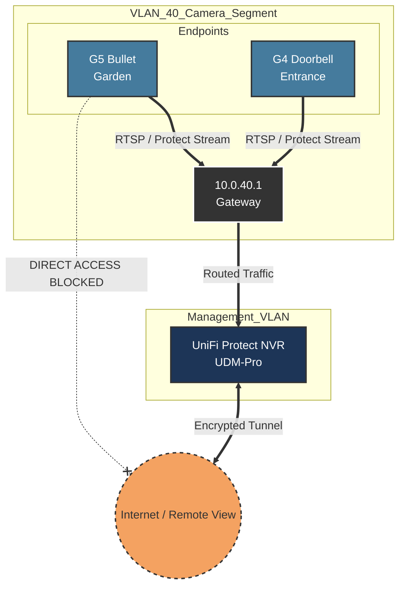

# VLAN 40 - Security (Cameras)

## Description
This VLAN is dedicated to physical security infrastructure, primarily hosting
high-bandwidth IP cameras and doorbells. Separation is critical here to prevent
video stream congestion from affecting regular network performance and to
ensure strict privacy.

## Design Philosophy
* **Bandwidth Isolation:** Video feeds generate constant, heavy
multicast/unicast traffic. Segregating this prevents packet loss on the Main or
Gaming networks.
* **Privacy First:** Cameras are restricted from accessing the internet
directly. Remote viewing is handled securely via the NVR (Network Video
Recorder) acting as a gateway/proxy.
* **Hardware Security:** Where possible, camera ports on switches are
MAC-locked or disabled when unused to prevent physical tampering.

## Security Posture
* **Direct Internet Access:** **Blocked**. Cameras cannot communicate with
cloud servers directly.
* **NVR Proxy:** The UniFi Protect NVR (running on UDM-Pro) resides on the
Management/Default network (or dedicated VLAN) and acts as the sole bridge for
remote access.
* **Client Isolation:** Enabled to prevent cameras from attacking each other in
the event of a compromise.

## IP Address Management (IPAM) Schema

IP assignment here heavily favors static/reserved IPs to ensure the NVR
maintains consistent connectivity to recording endpoints.

| IP-Range (Host) | Zone / Purpose      | Description                                  | Examples          |
| :---            | :---                | :---                                         | :---              |
| **.1**          | Network & Gateway   | Default Gateway (UDM-Pro)                    | `gw-vlan40.cam`   |
| **.2 - .19**    | Wifi Cameras        | Wireless endpoints (Doorbells, Instant cams) | `g4-doorbell`     |
| **.20 - .99**   | Wired Cameras (PoE) | Fixed PoE Cameras (Bullets, Domes)           | `g5-pro-driveway` |
| **.100 - .254** | DHCP Pool           | Spare / Maintenance                          |                   |

## Network Topology Visualization

This diagram emphasizes that the **NVR** is the central point of contact, and
cameras are endpoints rather than active internet devices.

## Transparency Note

The architecture and implementation detailed in this repository are 100% manual
and self-hosted. However, AI tools have been leveraged to refine the
documentation's structure and language to ensure readability.
