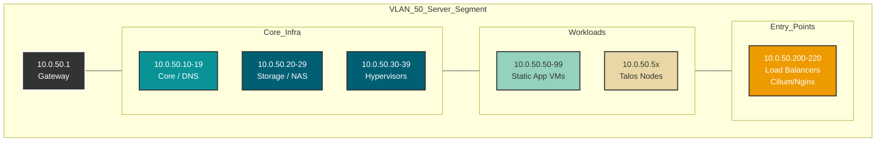

# VLAN 50 - Servers

## Description

This VLAN hosts the primary server infrastructure, containing both production
and testing environments. It serves as the backbone for all self-hosted
services and virtualization hosts.

## Design Philosophy

VLAN 50 is designed with a strict segmentation between **Infrastructure**
(Hypervisors, Storage) and **Workloads** (VMs, Containers).

* **Predictability:** Key infrastructure always resides in the lower `.1 - .49`
  range for easy identification during incident response.
* **Load Balancing:** The `.200+` range is reserved for ingress controllers and
  VIPs (Virtual IPs), mimicking cloud-like load balancer allocation.
* **DHCP:** Used primarily for ephemeral test VMs; all production services use
  static assignments via IPAM (or DHCP Reservations)

## Security Posture & Isolation
To ensure security, strict firewall rules (Layer 3/4) are enforced via the UDM-Pro:
* **Inbound Traffic:** Blocked by default from all VLANs except **Management (VLAN 1)** and specific ports exposed via **Load Balancers** (web/https).
* **Outbound Traffic:** Allowed for system updates, but DNS is intercepted and forced through local DNS (PiHole) to prevent rogue bypass.
* **Inter-VLAN:** The Server VLAN cannot initiate connections to the IoT or Guest networks (One-way trust).

## IP Address Management (IPAM) Schema

| IP-Range (Host) | Zone/Purpose            | Description                                  | Examples                 |
| :---            | :---                    | :---                                         | :---                     |
| **.1**          | Network & Gateway       | Default Gateway (UDM-Pro)                    | gw-vlan50.wollbro.se     |
| **.2 - .9**     | Net Mgmt / VRRP         | Switches or Redundancy ip (HSRP/VRRP)        | sw-main.wollbro.se       |
| **.10 - .19**   | Core Infrastructure     | DNS, NTP, AD, Radius, (Critical Services)    | pihole                   |
| **.20 - .29**   | Storage / SAN           | NAS, iSCSI targets, Backup servers           | truenas, minio           |
| **.30 - .39**   | Hypervisors (Hosts)     | Proxmox Nodes (Management interface)         | pve-01, pve-02           |
| **.40 - .49**   | Management VIPs         | Virtual IPs for cluster-management           | ha-cluster-vip           |
| **.50 - .99**   | App Servers (Static)    | VMs/LXC with static IPs (DBs, Cluster Nodes) | talos-cp-01, sql-01      |
| **.100 - .199** | DHCP Pool               | Dynamic clients / Temporary machines         |                          |
| **.200 - .220** | Load Balancers /Ingress | Cilium, Nginx Ingress                        | ingress-nginx            |
| **.221 - .254** | Reserved                | Infrastructure Spares /Out-of-band           |                          |

## Naming Convention
Hostnames follow a standardized format to ensure quick identification of OS and role:
`[service]-[role]-[number].[domain]`

* **service:** e.g., `pve` (Proxmox), `talos` (Talos), `sql` (Database)
* **role:** `cp` (Control Plane), `w` (Worker), `node` (Generic Node)
* **number:** 2-digit index (`01`, `02`)
* **Example:** `talos-cp-01.wollbro.se` (Kubernetes Control Plane Node 1)

## Network Topology Visualization

The schematic below visualizes the logical segmentation of the network.
Connectivity flows from the **Gateway**, through the **Core Infrastructure**
layers, down to the specific **Workloads**, which are then exposed via
**Entry Points** (Load Balancers).

## Transparency Note
The architecture and implementation detailed in this repository are 100% manual
and self-hosted. However, AI tools have been leveraged to refine the documentation's
structure and language to ensure readability.
