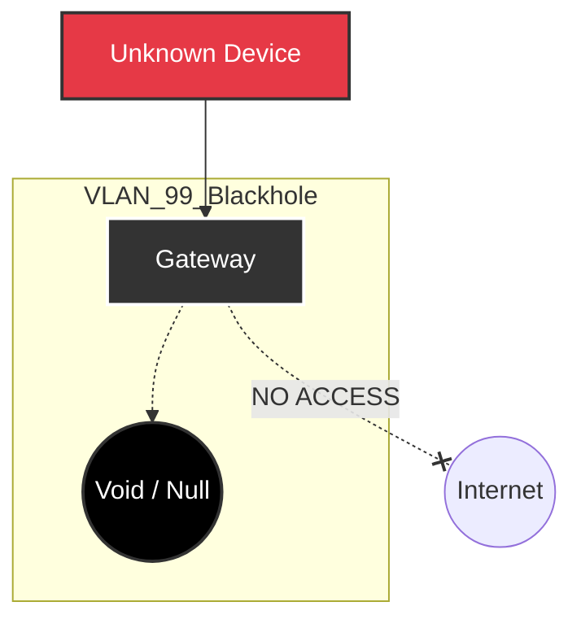

# VLAN 99 - Dummy (Blackhole)

## Description
The "Dummy" VLAN serves as a digital quarantine zone and a security catch-all
for unused physical ports. Ideally, this network is a "Blackhole" where traffic
goes to die.

## Design Philosophy
* **Physical Port Security:** Any unused wall jack or switch port in the house
  is patched to this VLAN by default. If an intruder (or curious child) plugs
  in a device, they receive an IP address but have zero connectivity.
* **Isolation:** This network has no routes to the internet and no routes to
  any other local VLAN.
* **Testing:** Occasionally used as a "Sandbox" to analyze the behavior of
  suspicious devices without risking the wider network.

## Security Posture
* **WAN Access:** **Blocked**.
* **LAN Access:** **Blocked**.
* **DNS:** Blocked or redirected to a local sinkhole.
* **Result:** A device connected here will show "Connected, No Internet" and
  cannot ping anything other than itself.

## IP Address Management (IPAM) Schema

| IP-Range (Host) | Zone / Purpose        | Description                                    | Examples |
| :---            | :---                  | :---                                           | :---     |
| **.1**          | Gateway (Unreachable) | Gateway interface (Drop rules applied)         |          |
| **.2 - .254**   | Quarantine Pool       | DHCP enabled purely to identify connected MACs |          |

## Network Topology Visualization

The simplest diagram of all: A box with no exits.

## Transparency Note

The architecture and implementation detailed in this repository are 100% manual
and self-hosted. However, AI tools have been leveraged to refine the
documentation's structure and language to ensure readability.
