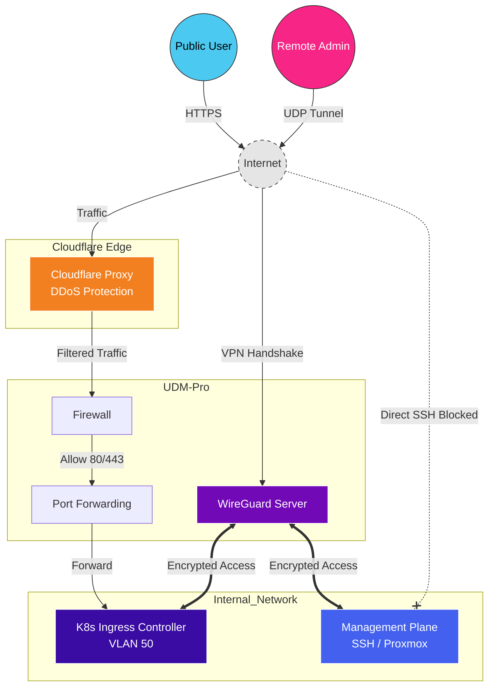

# Remote Access & Ingress Strategy

## Description
This document defines how external traffic connects to the internal
infrastructure. The strategy enforces a strict **"Minimal Attack Surface"**
policy: only essential web traffic is allowed via standard ports, while
administrative access is secured via WireGuard VPN.

## Public Ingress (Application Traffic)
Access to hosted applications (e.g., GitLab) is mediated through a single entry
point.

* **Open Ports:** Only `TCP 80` (HTTP) and `TCP 443` (HTTPS) are exposed on the
WAN interface.
* **NAT Strategy:**
  * Port 80/443 are forwarded directly to the **Kubernetes Ingress Controller**
  (Load Balancer VIP in VLAN 50).
  * No other internal IP is directly exposed via NAT.
* **WAF/Filtering:** Inbound traffic is routed via **Cloudflare Proxy** (Orange
Cloud). This obfuscates the residential Origin IP and provides DDoS protection
and Web Application Firewall (WAF) capabilities before traffic reaches the
gateway.

## Administrative Access (VPN)
Direct management of infrastructure (SSH to servers, Proxmox GUI, UDM
Management) is **strictly forbidden** over the public internet.

* **Protocol:** **WireGuard** (Running natively on UDM-Pro).
* **Rationale:** WireGuard offers superior throughput compared to OpenVPN/L2TP
and remains "silent" to port scanners (UDP) until authenticated.
* **Client IP Assignment:** VPN clients are assigned IPs in a dedicated subnet
(e.g., `10.0.2.0/24`) and are subject to firewall rules.

## Emergency Access (Out-of-Band)
To strictly minimize the attack surface and dependency on vendor cloud
infrastructure, convenience features such as **UniFi Teleport** are explicitly
**disabled**.

* **Policy:** No cloud-relayed VPN tunnels are permitted.
* **Failure Scenario:** In the event of a WireGuard failure, misconfiguration,
or DDNS outage.
* **Recovery Procedure:** Physical presence is required ("Break Glass").
Administration is restored via direct local console access to the UDM-Pro or
Server Rack.

## Access Policy Matrix

| Traffic Type     | Destination              | Method                      | Ports       |
| :--------------- | :----------------------- | :-------------------------- | :---------- |
| **Public Users** | Hosted Apps (K8s)        | Cloudflare Proxy -> Ingress | 443 (HTTPS) |
| **Admin**        | Infrastructure (SSH/GUI) | WireGuard VPN               | Tunnel      |
| **Admin**        | K8s API (kubectl)        | WireGuard VPN               | Tunnel      |
| **Attackers**    | SSH / RDP / Database     | **BLOCKED**                 | All Closed  |

## Logical Topology

The diagram illustrates the separation between "User Traffic" (Ingress) and
"Admin Traffic" (VPN).

## Transparency Note

The architecture and implementation detailed in this repository are 100% manual
and self-hosted. However, AI tools have been leveraged to refine the
documentation's structure and language to ensure readability.
