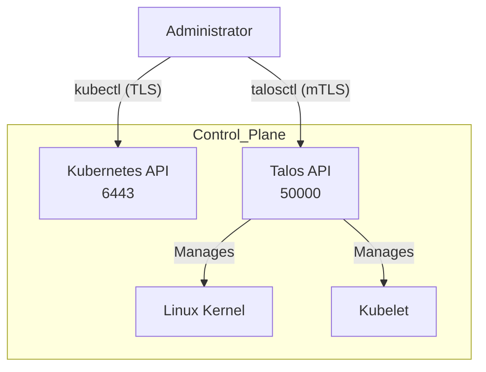

# Talos Linux Architecture

## Description

This document describes the operating system choice for the Kubernetes cluster.
The cluster runs on **Talos Linux**, an immutable, API-first operating system
designed specifically for Kubernetes.

## Design Philosophy

We have moved away from general-purpose Linux distributions (like Ubuntu/Debian)
to reduce administrative overhead and increase security.

* **Immutable:** The root filesystem is read-only. No packages can be installed,
  and no configuration changes can be made to the live filesystem.
* **No SSH:** Access is managed solely via the `talosctl` CLI tool over mutual
  TLS (mTLS). There is no `sshd` process and no shell access.
* **Ephemeral:** Nodes can be destroyed and recreated without data loss, as all
  state is stored in the cluster (etcd) or on external storage.

## Security Posture

Talos minimizes the attack surface by design:

* **Minimal Footprint:** Only the components required to run Kubernetes
  (kubelet, containerd, kernel) are included.
* **Privilege Separation:** No persistent root user or password exists.
* **API Access:** All node management (reboots, upgrades, logs) is done via the
  Talos API (port 50000), authenticated via client certificates generated during
  bootstrap.

## Versioning Strategy

* **OS Updates:** Upgrades are performed by updating the `install.image`
  reference in Terraform/MachineConfig and performing a rolling update via the
  API.
* **Extensions:** System extensions (like `iscsi-tools`) are baked into the
  boot image or loaded dynamically during bootstrap.

## Architecture Visualization

## Transparency Note

The architecture and implementation detailed in this repository are 100% manual
and self-hosted. However, AI tools have been leveraged to refine the
documentation's structure and language to ensure readability.
