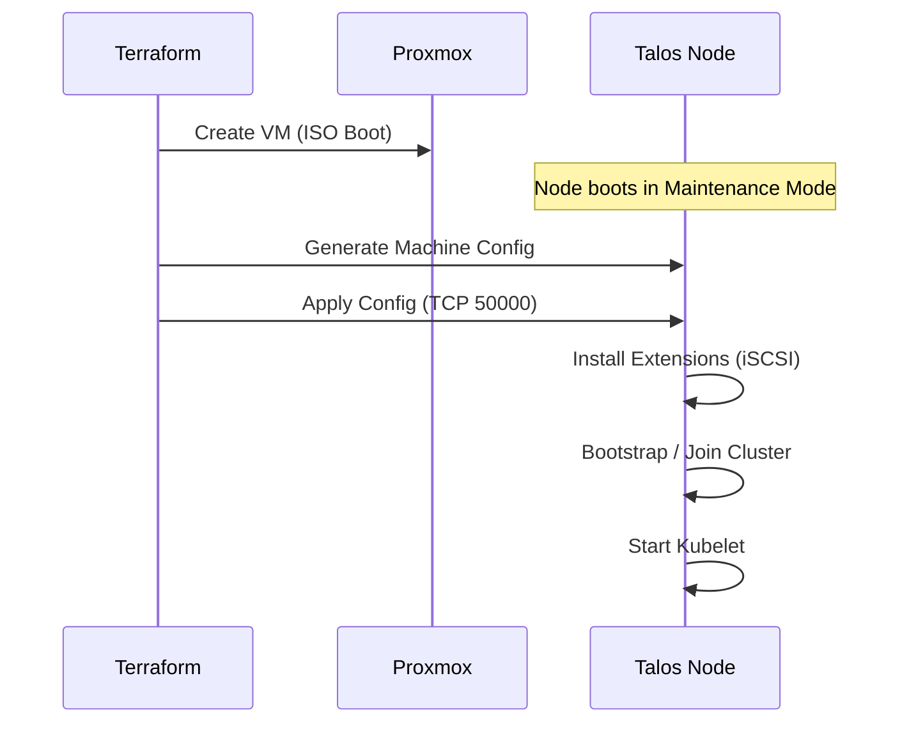

# Talos Machine Configuration

## Description

This document details how the Talos nodes are configured. Unlike traditional
systems with `/etc/` files, Talos uses a single YAML-based **Machine Config**
file.

## Configuration Management

The Machine Config is generated and managed by **Terraform**. No manual editing
of config files on the nodes is performed.

* **Generator:** `talos_machine_secrets` and `talos_machine_configuration`
  resources.
* **Application:** `talos_machine_configuration_apply` pushes the config to the
  nodes.

## Configuration Profiles

We use two distinct profiles:
1. **Control Plane:** Includes etcd configuration and control plane components.
2. **Worker:** (Not currently used, we run a converged cluster) Basic kubelet
   config.

## Extensions & Patches

To support our specific hardware and storage requirements, the base
configuration is patched during provisioning.

### 1. iSCSI Support
To allow Democratic-CSI to mount TrueNAS volumes, we install the iSCSI
extension.
```yaml
machine:
  install:
    extensions:
      - image: ghcr.io/siderolabs/iscsi-tools:v0.1.4
````

### 2\. Kubelet Configuration

We allow privileged containers to support system-level pods (like Cilium and
CSI drivers).

```yaml
machine:
  features:
    kubePrism:
      enabled: true
      port: 7445
  kubelet:
    extraArgs:
      # Allow privilege escalation for CSI drivers
      allow-privileged: true
```

### 3\. Network Configuration

Static IPs are assigned via kernel arguments or network interface config blocks
to ensure the Control Plane VIP remains stable.

## Visualization: Config Injection



## Transparency Note

The architecture and implementation detailed in this repository are 100% manual
and self-hosted. However, AI tools have been leveraged to refine the
documentation's structure and language to ensure readability.
