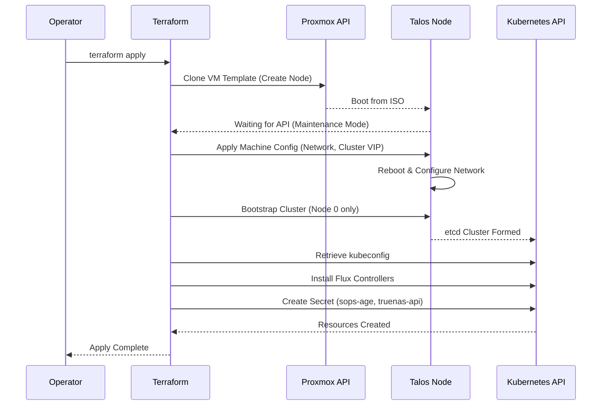

# Terraform Provisioning Lifecycle & Layering

## Description

This document details the lifecycle management of compute resources using
**Terraform**. It covers the provisioning of Proxmox VMs, the bootstrapping of
the Talos Linux operating system, and the initial injection of GitOps
controllers (Flux).

## Design Philosophy

The provisioning layer is designed to be **declarative**, **idempotent** and
**layered**. The goal is to enable a "Zero Touch" recovery while strictly
isolating the lifecycle of physical hardware from virtual platforms.

* **Infrastructure as Code (IaC):** The entire state of the datacenter (VMs,
  IPs, MAC addresses) is defined in `.tf` files. Manual changes in Proxmox are
  considered "drift" and will be corrected (overwritten) on the next apply.
* **Separation of Concerns:** Terraform handles **Infrastructure** (Hardware,
  OS, Network). Flux handles **Software** (Kubernetes Manifests, Helm Charts).
* **Layered Architecture:** Infrastructure is split into distinct lifecycle
  layers (Hypervisor Config vs. Platform Logic) to reduce the "Blast Radius".
* **Secure Bootstrap:** Sensitive keys (SOPS age key, API tokens) are injected
  into the cluster memory during bootstrap, never stored in plaintext on disk
  image.

## Architecture Layers

The `infrastructure/` directory is organized by the lifecycle of the resources.

### Layer 0: Hypervisors (`01-hypervisors`)
* **Scope:** Physical Hardware Configuration (Proxmox Hosts).
* **Responsibilities:** Storage Pools (ZFS), Network Bridges (VLAN-aware), User
Management.
* **Lifecycle:** Rare updates (Hardware changes).

### Layer 1: Platforms (`02-platforms`)
* **Scope:** Virtual Infrastructure (Kubernetes Clusters, VMs).
* **Responsibilities:** Provisioning VMs, Bootstrapping Talos, Injecting Flux.
* **Lifecycle:** Frequent updates (Scaling, Upgrading).

### Layer 2: Legacy / Standalone (`03-legacy`)
* **Scope:** Ad-hoc systems not managed by the Kubernetes platform.
* **Responsibilities:** Legacy DNS (PiHole) or standalone appliances.

## Security Posture & Isolation

Terraform operates with high privileges and requires strict handling:

* **State File:** The `terraform.tfstate` contains sensitive data (IPs,
  potentially keys). It resides on a NAS (TrueNAS) via MiniIO S3 and is treated
  as a sensitive asset. Each Layer has its own isolated state file.
* **Credentials:** Provider credentials (Proxmox API, TrueNAS API) are passed
  via `terraform.tfvars`, never committed to Git.
* **Bootstrap Secrets:** The `age.agekey` is read from the local machine during
  apply to inject secret decryption capabilities into the cluster.

## Resource Provisioning Schema (Layer 1: Platforms)

The Terraform execution plan for bootstrapping a cluster
(`02-platforms/k8s-prod`) follows this strict dependency order:

| Stage          | Resource Type                       | Description                                                            |
| :------------- | :---------------------------------- | :--------------------------------------------------------------------- |
| **1. Prereqs** | `data.proxmox_...`                  | Reads existing Bridges/Storage defined in Layer 0.                     |
| **2. Storage** | `truenas_dataset`                   | (Optional) Ensures parent ZFS datasets exist on storage for CSI usage. |
| **3. Compute** | `proxmox_virtual_environment_vm`    | Clones Talos ISO, sets CPU/RAM, assigns static MAC/IP.                 |
| **4. Config**  | `talos_machine_configuration_apply` | Pushes `machineconfig` YAML to the nodes via API.                      |
| **5. Cluster** | `talos_machine_bootstrap`           | Signals the control plane to form the etcd cluster.                    |
| **6. GitOps**  | `helm_release` (Flux)               | Installs Flux v2 into the cluster to take over management.             |

## Naming & Variable Standards

Terraform uses a modular structure to ensure reusability across environments.

* **Modules:** Core logic resides in `infrastructure/modules/`
  (e.g., `talos_cluster`, `flux_bootstrap`).
* **Environments:** State and variable definitions reside in
  `infrastructure/02-platforms/`.
* **Variables:**
  * `target_node`: Defines which physical host (Layer 0) to provision on.
  * `nodes_count`: Defines cluster size.
  * `cluster_name`: Defines the context name in kubeconfig.

## Provisioning Visualization

The flow of a "Cold Boot" (Terraform Apply) for the Production Cluster.

## Transparency Note

The architecture and implementation detailed in this repository are 100% manual
and self-hosted. However, AI tools have been leveraged to refine the
documentation's structure and language to ensure readability.
