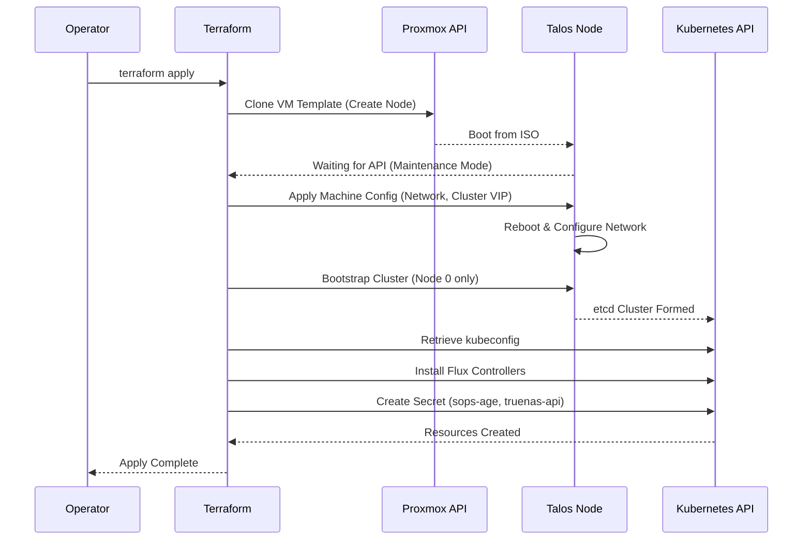

# Terraform Provisioning Lifecycle

## Description

This document details the lifecycle management of compute resources using
**Terraform**. It covers the provisioning of Proxmox VMs, the bootstrapping of
the Talos Linux operating system, and the initial injection of GitOps
controllers (Flux).

## Design Philosophy

The provisioning layer is designed to be **declarative** and **idempotent**.
The goal is to enable a "Zero Touch" recovery where a single command restores
the entire infrastructure.

* **Infrastructure as Code (IaC):** The entire state of the datacenter (VMs,
  IPs, MAC addresses) is defined in `.tf` files. Manual changes in Proxmox are
  considered "drift" and will be corrected (overwritten) on the next apply.
* **Separation of Concerns:** Terraform handles **Infrastructure** (Hardware,
  OS, Network). Flux handles **Software** (Kubernetes Manifests, Helm Charts).
* **Secure Bootstrap:** Sensitive keys (SOPS age key, API tokens) are injected
  into the cluster memory during bootstrap, never stored in plaintext on disk
  image.

## Security Posture & Isolation

Terraform operates with high privileges and requires strict handling:

* **State File:** The `terraform.tfstate` contains sensitive data (IPs,
  potentially keys). It resides on a NAS through MiniIO and is treated as a
  sensitive asset.
* **Credentials:** Provider credentials (Proxmox API, TrueNAS API) are passed
  via `terraform.tfvars`, never committed to Git.
* **Bootstrap Secrets:** The `age.agekey` is read from the local machine during
  apply to inject secret decryption capabilities into the cluster.

## Resource Provisioning Schema

The Terraform execution plan follows this strict dependency order:

| Stage          | Resource Type                         | Description                                                |
| :---           | :---                                  | :---                                                       |
| **1. Network** | `proxmox_virtual_environment_network` | (Optional) Configures bridges/VLANs if not pre-existing.   |
| **2. Storage** | `truenas_dataset`                     | (Optional) Ensures parent ZFS datasets exist on storage.   |
| **3. Compute** | `proxmox_virtual_environment_vm`      | Clones Talos ISO, sets CPU/RAM, assigns static MAC/IP.     |
| **4. Config**  | `talos_machine_configuration_apply`   | Pushes `machineconfig` YAML to the nodes via API.          |
| **5. Cluster** | `talos_machine_bootstrap`             | Signals the control plane to form the etcd cluster.        |
| **6. GitOps**  | `helm_release` (Flux)                 | Installs Flux v2 into the cluster to take over management. |

## Naming & Variable Standards

Terraform uses a modular structure to ensure reusability.

* **Modules:** Core logic resides in `modules/` (e.g., `talos_cluster`,
  `flux_bootstrap`).
* **Environments:** State and variable definitions reside in
  `environments/prod`.
* **Variables:**
  * `nodes_count`: Defines cluster size.
  * `nodes_memory`: Defines RAM per node (Standard: 8192MB).
  * `cluster_name`: Defines the context name in kubeconfig.

## Provisioning Visualization

The flow of a "Cold Boot" (Terraform Apply) from the operator's machine.

## Transparency Note

The architecture and implementation detailed in this repository are 100% manual
and self-hosted. However, AI tools have been leveraged to refine the
documentation's structure and language to ensure readability.
