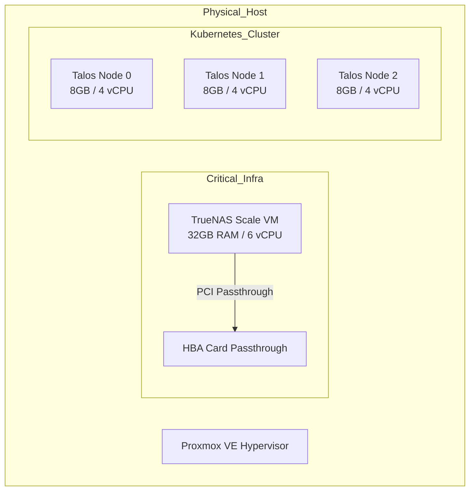

# Proxmox & Talos Virtualization Strategy

## Description
This document outlines the virtualization strategy hosting the Kubernetes
cluster. The underlying hardware is a hyper-converged server running
**Proxmox VE**, hosting both the storage appliance (TrueNAS) and the compute
nodes (Talos Linux).

## Design Philosophy
The compute layer is designed to be **immutable** and **ephemeral**. We treat
Kubernetes nodes as "cattle, not pets."

* **Stateless OS:** Talos Linux is used for the Kubernetes nodes. It has no
  SSH, no shell, and is configured entirely via API/Configuration files.
* **Infrastructure as Code:** All VMs are provisioned via **Terraform** using
  the Telmate Proxmox provider. No manual creation of VMs occurs in the GUI.
* **Resource Reservation:** Resources are strictly partitioned to ensure
  TrueNAS (Storage) stability while maximizing Kubernetes performance.

## Resource Allocation Schema

### prod-srv-01

The physical host (36 vCPU, 88GB RAM) is partitioned as follows:

| Role              | Hostname Pattern | vCPU | RAM   | Disk (Boot)   | IP Assignment  |
| :---              | :---             | :--- | :---  | :---          | :---           |
| **Storage**       | `truenas`        | 6    | 32 GB | Passthrough   | Static (`.20`) |
| **Control Plane** | `talos-node-0`   | 4    | 8 GB  | 32 GB (Local) | Static (`.51`) |
| **Control Plane** | `talos-node-1`   | 4    | 8 GB  | 32 GB (Local) | Static (`.52`) |
| **Control Plane** | `talos-node-2`   | 4    | 8 GB  | 32 GB (Local) | Static (`.53`) |
| **Reserve**       | *Available*      | 18   | 32 GB | -             | -              |

## Provisioning Workflow

The lifecycle of a compute node is fully automated:

1. **Terraform:** Requests ISO download and VM creation from Proxmox API.
2. **ISO Boot:** VMs boot from the Talos ISO.
3. **Bootstrap:** Terraform injects the initial `machineconfig`
   (including network and cluster VIP).
4. **Cluster Join:** Nodes automatically discover the control plane VIP and
   join the cluster.

## Architecture Visualization

## Transparency Note

The architecture and implementation detailed in this repository are 100% manual
and self-hosted. However, AI tools have been leveraged to refine the
documentation's structure and language to ensure readability.
