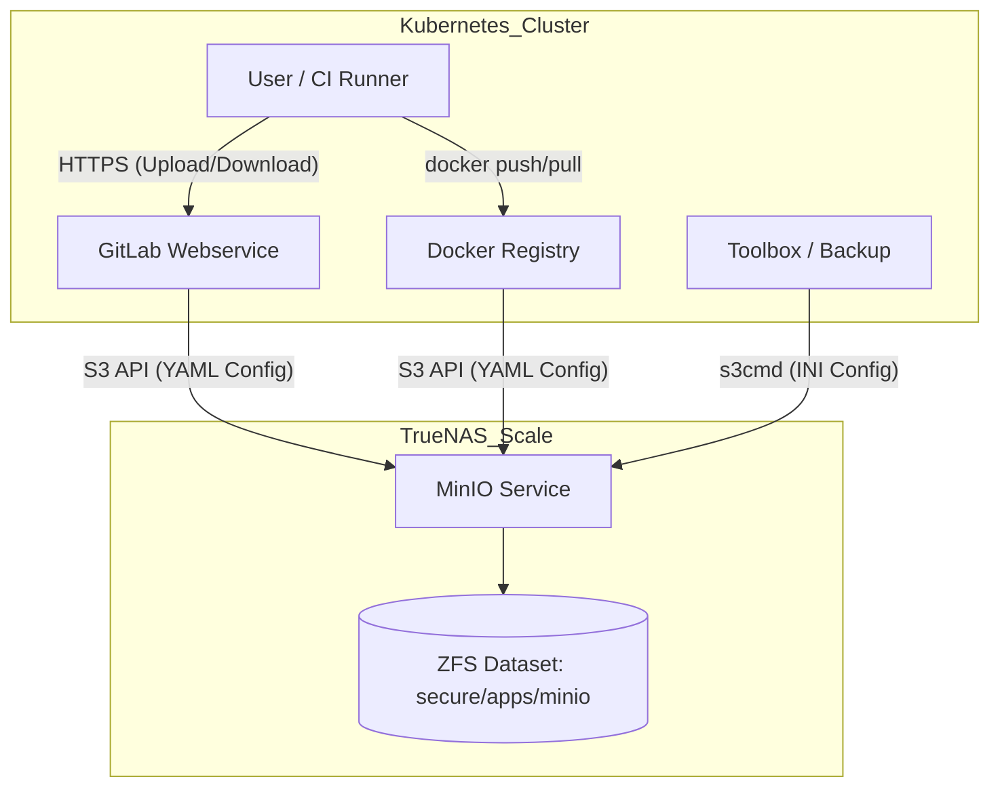

# MinIO Object Storage Architecture

## Description

This document details the configuration and topology of the S3-compatible Object
Storage used by the cluster. We utilize a self-hosted **MinIO** instance running
as an application on **TrueNAS Scale**. This storage backend handles all
unstructured data (artifacts, logs, uploads) for GitLab.

## Design Philosophy

The object storage layer is designed to keep the Kubernetes workload
**stateless** and facilitate easy backups.

* **Consolidated Object Storage:** We utilize GitLab's modern "Consolidated"
  configuration, using a single credential pair and endpoint for all object
  types, rather than managing separate secrets for artifacts, LFS, etc.
* **Proxy Download:** GitLab is configured to proxy all file downloads. This
  ensures that end-users never communicate directly with the internal MinIO
  server, keeping it isolated on the private network.
* **Tiered Backup:** The MinIO data resides on the `secure` ZFS dataset branch,
  which is automatically encrypted and replicated off-site (OneDrive), providing
  disaster recovery for the data at rest.

## Security Posture & Isolation

* **Network Isolation:** The MinIO service listens only on the internal Storage
  VLAN. It is not exposed to the public internet via Ingress or LoadBalancer.
* **TLS Encryption:** Traffic between GitLab and MinIO is encrypted via HTTPS.
  * *Note:* During bootstrap/recovery, SSL verification might be disabled for
  specific tools (like `s3cmd`) if internal DNS/Cert trust is not yet
  established.
* **Access Control:** Authentication is handled via Access Key/Secret Key pairs
  stored in Kubernetes Secrets encrypted with SOPS.

## Bucket Topology

The following buckets must be manually provisioned in MinIO to support the
workload.
Failure to create these will result in job failures or backup errors.

| Bucket Name              | Purpose                                          | Retention Policy          |
| :---                     | :---                                             | :---                      |
| `git-lfs`                | Large File Storage (Git LFS) objects.            | Permanent                 |
| `gitlab-artifacts`       | CI/CD build outputs and logs.                    | Expired by GitLab Policy  |
| `gitlab-backups`         | System-wide `.tar` backups generated by Toolbox. | 7 Days (Lifecycle Rule)   |
| `gitlab-ci-secure-files` | Secure files for CI pipelines (keystores).       | Permanent                 |
| `gitlab-mr-diffs`        | External storage for Merge Request diffs.        | Permanent                 |
| `gitlab-packages`        | Package Registry (NPM, Maven, NuGet).            | Permanent                 |
| `gitlab-pages`           | Static sites hosted via GitLab Pages.            | Updated on Deploy         |
| `gitlab-terraform-state` | Remote state files for Terraform backends.       | Permanent                 |
| `gitlab-uploads`         | User uploads (Issue attachments, avatars).       | Permanent                 |
| `registry`               | Docker Container Registry layers.                | Managed by Cleanup Policy |

## Configuration Schema

### 1. Main Application Connection
GitLab Webservice, Sidekiq, and Registry use a consolidated connection config.
* **Kubernetes Secret:** `gitlab-minio-connection`
* **Format:** YAML
* **Content:** Provider (AWS), Endpoint, Region, Credentials.

### 2. Backup Utility Override (Important)
The GitLab Toolbox (Backup Utility) uses `s3cmd` which requires a legacy
INI-format configuration and has stricter SSL/Host requirements.
* **Kubernetes Secret:** `gitlab-backup-s3cfg`
* **Format:** INI (`.s3cfg`)
* **Content:** `host_base`, `host_bucket`, `check_ssl_certificate=False` (to
  avoid IP/DNS mismatches during recovery).

## Data Flow Visualization

## Transparency Note

The architecture and implementation detailed in this repository are 100% manual
and self-hosted. However, AI tools have been leveraged to refine the
documentation's structure and language to ensure readability.
