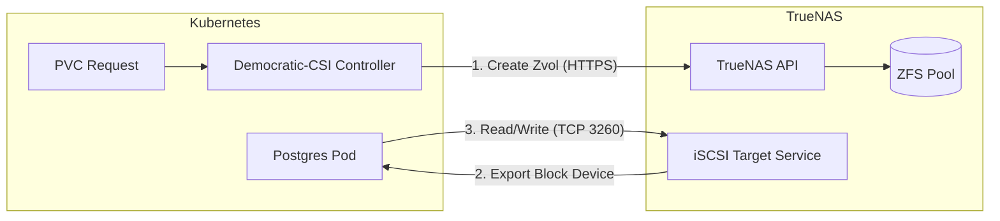

# iSCSI Storage Architecture

## Description
This document details the block storage integration between **TrueNAS Scale**
and the **Kubernetes Cluster**. Unlike file-level storage (NFS), iSCSI provides
raw block devices to pods, essential for high-performance databases like
PostgreSQL and Redis.

## Design Philosophy
We utilize **Democratic-CSI** to dynamically provision storage. This moves the
responsibility of volume management from the storage admin to the Kubernetes
API.

* **Block vs File:** iSCSI was chosen over NFS to eliminate "root squash" and
  permission issues common with Bitnami/Postgres containers.
* **Dynamic Provisioning:** Volumes are created on-demand as **Zvols** when a
  `PersistentVolumeClaim` (PVC) is created in the cluster.
* **Dataset Separation:** Snapshots and Blocks are kept in sibling datasets
  to avoid recursion/locking issues.

## TrueNAS Configuration Profile

| Setting          | Value                     | Description                                       |
| :---             | :---                      | :---                                              |
| **Base Dataset** | `storage/k8s-block`       | Parent dataset for Kubernetes storage             |
| **Disk Dataset** | `storage/k8s-block/disks` | Where Zvols (actual data) reside                  |
| **Snap Dataset** | `storage/k8s-block/snaps` | Where ZFS snapshots are stored                    |
| **Portal ID**    | `1`                       | Listens on `10.0.50.20:3260`                      |
| **Initiator**    | `Allow All`               | Simplifies cluster scaling (IP based access list) |
| **API Access**   | `ApiKey`                  | Authentication for the CSI Driver Controller      |

## Data Flow & Mounting

When a Pod (e.g., GitLab PostgreSQL) requests storage:

1. **Request:** Pod claims a PVC via StorageClass `freenas-iscsi`.
2. **Provision:** Democratic-CSI Controller talks to TrueNAS API -> Creates Zvol.
3. **Transport:** TrueNAS exports the Zvol as an iSCSI Target.
4. **Mount:** The Talos Node (via `iscsid`) logs into the target and formats it
   as `ext4`.
5. **Access:** The filesystem is mounted into the Pod container.

## Logical Topology

## Transparency Note

The architecture and implementation detailed in this repository are 100% manual
and self-hosted. However, AI tools have been leveraged to refine the
documentation's structure and language to ensure readability.
