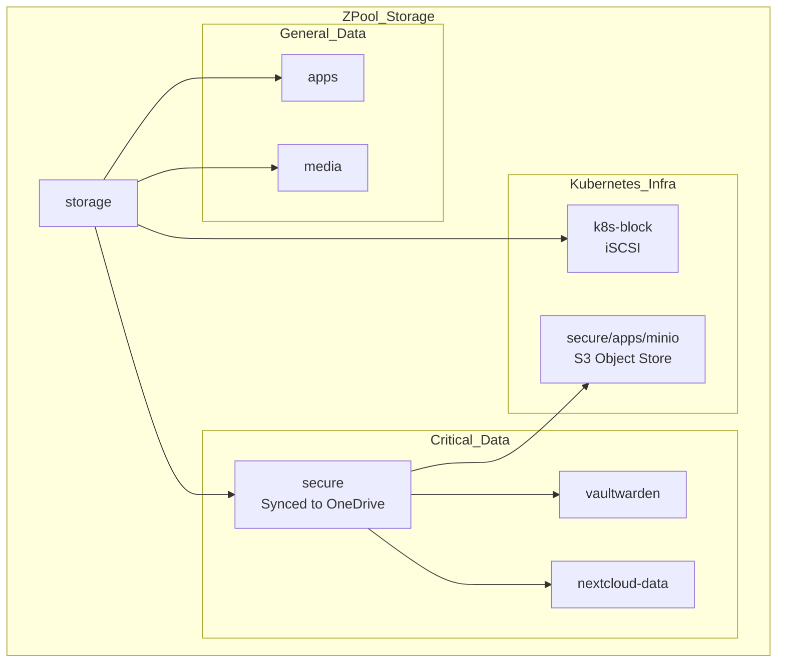

# ZFS Pool Topology

## Description

This document details the storage topology used within **TrueNAS Scale**.
It covers both the physical arrangement of disks (vDevs) and the logical
hierarchy of datasets used to segregate Kubernetes workloads from other homelab
data.

## Design Philosophy

The storage system is designed with a **Tiered Data Strategy**. Data is
categorized based on its criticality and backup requirements, rather than just
by application.

* **Security First:** The `secure` dataset branch contains critical data
  (Vaultwarden, MinIO, Nextcloud Data) and is automatically encrypted and
  replicated offsite (OneDrive via rclone).
* **Performance/Block:** The `k8s-block` branch is dedicated to iSCSI to
  optimize record sizes and snapshots for database workloads without interfering
  with file storage.
* **Disposable/Recreatable:** The `apps` and `media` branches contain data that
  is either easily reproducible (container configs) or large static media.

## Physical Topology (vDevs)

The `storage` pool is backed by a RAIDZ2 array passed through from the Proxmox
hypervisor.

| Type          | Configuration             | Capacity (Raw) | Purpose                                               |
| :---          | :---                      | :---           | :---                                                  |
| **Data vDev** | 1x RAIDZ2 (6x 3TB WD Red) | ~18 TB         | Main data storage with double-parity fault tolerance. |
| **Log/Cache** | None                      | -              | Standard ZIL/ARC in RAM.                              |

*Note: RAIDZ2 provides high reliability (can survive 2 simultaneous disk
failures) at the cost of slightly lower random write IOPS compared to Mirror
VDevs.*

## Logical Topology (Datasets)

The dataset structure is organized to separate workloads for backup granularity
and access control.

* **Pool:** `storage`
  * **Branch:** `k8s-block` (iSCSI Root)
    * `disks` (Live Kubernetes PVCs/Zvols)
    * `snaps` (Volume Snapshots)
  * **Branch:** `secure` (Critical Data - Offsite Backup)
    * `apps/minio` (GitLab Artifacts, Registry, Terraform State)
    * `apps/vaultwarden` (Password Database)
    * `apps/rclone` (Backup Configs)
    * `nextcloud-data` (Family Documents/Photos)
    * `backups` (General Systems Backups)
  * **Branch:** `apps` (Non-Critical)
    * `nextcloud` (App Config/DB)
  * **Branch:** `media` (Static Content)
    * `recordings` (IPTV)

## Configuration Profile

Global ZFS properties set on the `storage` pool to optimize performance for this
specific hardware:

| Property        | Value      | Rationale                                                                             |
| :---            | :---       | :---                                                                                  |
| **compression** | `lz4`      | Industry standard. Low CPU overhead with good compression ratio.                      |
| **atime**       | `off`      | Disables "access time" writes on read. Significant performance boost for random I/O.  |
| **dedup**       | `off`      | Deduplication is RAM-intensive and detrimental to performance on this hardware scale. |
| **sync**        | `standard` | Balances data safety with write performance.                                          |

## Visualization

## Transparency Note

The architecture and implementation detailed in this repository are 100% manual
and self-hosted. However, AI tools have been leveraged to refine the
documentation's structure and language to ensure readability.
