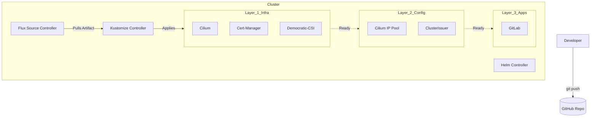

# GitOps Architecture (Flux v2)

## Description
The cluster state is entirely managed by **Flux v2**. No manual changes
(`kubectl apply`) are permitted. The repository acts as the Single Source of
Truth (SSoT) for both infrastructure components and applications.

## Design Philosophy
The repository structure is designed to handle dependencies and secret
management securely and automatically.

* **Layered Application:** We use a dependency chain (`Infrastructure` ->
  `Certs` -> `Apps`) to ensure CRDs and Controllers exist before Apps are
  deployed.
* **Secret Management:** **Mozilla SOPS** is used to encrypt secrets at rest
  in the Git repository. Flux decrypts them in-cluster using a private Age key.
* **Disaster Recovery:** The bootstrap process is designed so that a single
  `terraform apply` restores the entire software stack without manual
  intervention.

## Repository Structure & Flow

| Layer              | Path                                      | Description                                  | Dependencies |
| :---               | :---                                      | :---                                         | :---         |
| **0. Bootstrap**   | `infrastructure/`                         | Provisions Cluster & Installs Flux           | None         |
| **1. Controllers** | `gitops/flux/infrastructure/controllers/` | Installs Helm Charts (Cilium, CSI, IP Pools) | Flux System  |
| **2. Certs**       | `gitops/flux/infrastructure/certs/`       | Installs Issuers & Certs                     | Layer 1      |
| **3. Apps**        | `gitops/flux/apps/`                       | End-user applications (GitLab, Monitoring)   | Layer 2      |

## Reconciliation Flow

## Secret Decryption (SOPS)

Secrets are encrypted using Age. The decryption key is injected into the cluster
during the Terraform bootstrap phase.

1. Flux pulls encrypted `.yaml` from Git.
2. Flux identifies `.sops.yaml` configuration.
3. Flux uses the `sops-age` secret in `flux-system` namespace to decrypt.
4. Decrypted Secret is applied to Kubernetes (in-memory/etcd only).

## Transparency Note

The architecture and implementation detailed in this repository are 100% manual
and self-hosted. However, AI tools have been leveraged to refine the
documentation's structure and language to ensure readability.
