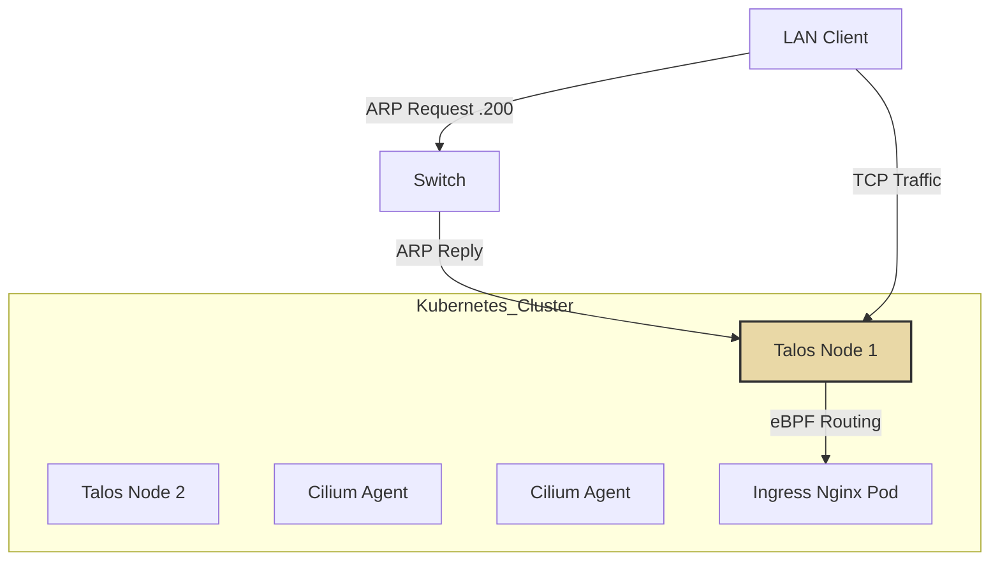

# Cilium CNI & Networking Architecture

## Description

This document details the Container Network Interface (CNI) choice and
configuration.
We utilize **Cilium** to handle all pod-to-pod communication, service load
balancing, and network policies. It completely replaces the standard
`kube-proxy`.

## Design Philosophy

The network layer is designed for **performance** and **simplicity** by
leveraging eBPF and removing the need for external hardware load balancers.

* **Kube-Proxy Replacement:** Cilium runs in `strict` replacement mode, using
  eBPF for high-performance packet filtering and routing without IPtables
  overhead.
* **L2 Announcements:** Instead of using MetalLB or BGP, we use Cilium's
  built-in Layer 2 Announcement feature to respond to ARP requests for Service
  IPs.
* **Hubble:** (Optional/Future) Provides deep visibility into network flows.

## Network Configuration Schema

| Setting               | Value            | Description                                |
| :---                  | :---             | :---                                       |
| **Pod CIDR**          | `10.244.0.0/16`  | Internal IP range for Pods.                |
| **Service CIDR**      | `10.96.0.0/12`   | Internal IP range for ClusterIP Services.  |
| **LoadBalancer CIDR** | `10.0.50.200/29` | External IPs exposed on the LAN (VLAN 50). |

## Load Balancing Strategy

Services of type `LoadBalancer` (like Ingress Nginx) are assigned an IP from the
`CiliumLoadBalancerIPPool`.

1. **IP Allocation:** Flux creates a pool of IPs defined in
   `cilium-ip-pool.yaml`.
2. **Assignment:** The Service requests an IP (e.g., `10.0.50.200`).
3. **Announcement:** The node hosting the pod answers ARP requests for `.200`.
4. **Routing:** Traffic hits the node and is routed via eBPF directly to the
   pod.

## Architecture Visualization

## Transparency Note

The architecture and implementation detailed in this repository are 100% manual
and self-hosted. However, AI tools have been leveraged to refine the
documentation's structure and language to ensure readability.
