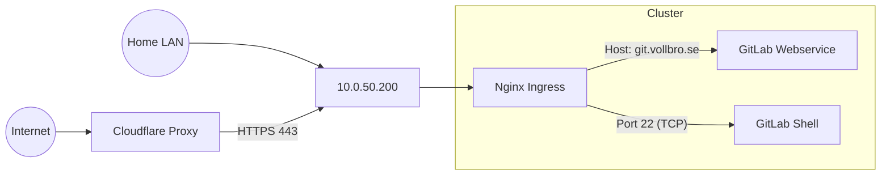

# Ingress Strategy (Nginx)

## Description

**Ingress Nginx** acts as the single entry point (Gateway) for all HTTP/HTTPS
and SSH traffic entering the cluster. It routes traffic based on hostnames
(`git.vollbro.se`, `registry...`) to the correct internal services.

## Design Philosophy

* **Single LoadBalancer:** To conserve IP addresses and simplify DNS, only the
  Ingress Controller service exposes a LoadBalancer IP (`10.0.50.200`). All
  other apps use Ingress resources.
* **Split-Horizon Access:**
  * **External:** Accessed via Cloudflare Proxy (Port 443 only).
    Protected against DDoS.
  * **Internal:** Accessed via local DNS pointing directly to `.200`.
    Full access (including SSH).
* **TCP Passthrough:** To support Git-over-SSH on port 22, the Ingress
  Controller is configured to pass TCP traffic on port 22 directly to the
  `gitlab-shell` service.

## Configuration Details

| Parameter           | Value         | Note                                             |
| :---                | :---          | :---                                             |
| **External IP**     | `10.0.50.200` | Managed by Cilium IPAM.                          |
| **Ports**           | `80`, `443`   | Web Traffic (HTTP redirects to HTTPS).           |
| **Passthrough**     | `22`          | TCP Stream to `gitlab/gitlab-shell:22`.          |
| **Proxy Body Size** | `512m`        | Increased to support large Git pushes over HTTP. |

## Traffic Flow Visualization

## Transparency Note

The architecture and implementation detailed in this repository are 100% manual
and self-hosted. However, AI tools have been leveraged to refine the
documentation's structure and language to ensure readability.
