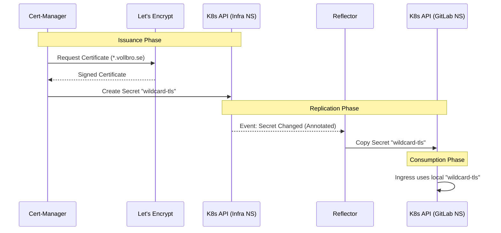

# Certificate Management & PKI

## Description

This document describes the Public Key Infrastructure (PKI) strategy. We utilize
**Cert-Manager** to automate the issuance and renewal of TLS certificates
from **Let's Encrypt**, and **Reflector** to distribute these certificates
across Kubernetes namespaces.

## Design Philosophy

The certificate strategy prioritizes **automation**, **privacy**, and
**efficiency**.

* **DNS-01 Validation:** Instead of opening HTTP ports to the internet
  (HTTP-01), we use Cloudflare's API to prove domain ownership. This allows us
  to issue valid certificates for internal-only services or servers behind
  strict firewalls.
* **Wildcard Certificates:** We issue a single wildcard certificate
  (`*.vollbro.se`) to cover all subdomains (`git`, `registry`, `minio`, `kas`).
* **"Issue Once, Mirror Everywhere":** To avoid Let's Encrypt rate limits
  (specifically Duplicate Certificate limits), the certificate is issued in a
  central namespace and automatically mirrored to application namespaces via
  Reflector.
* **GitOps Integration:** Certificates are defined as Kubernetes manifests
  (`Certificate`), ensuring they are restored automatically during a disaster
  recovery scenario.

## Configuration Schema

| Component           | Setting         | Description                                                         |
| :------------------ | :-------------- | :------------------------------------------------------------------ |
| **Issuer Type**     | `ClusterIssuer` | Global issuer available to all namespaces.                          |
| **Solver**          | `DNS01`         | Uses Cloudflare API Token.                                          |
| **Environment**     | `Production`    | Uses Let's Encrypt Production environment.                          |
| **Secret Location** | `cert-manager`  | The API Token must reside in the `cert-manager` namespace.          |
| **Replicator**      | `Reflector`     | Emberstack Reflector watches for annotated secrets and copies them. |

## Centralized Issuance & Replication

To resolve race conditions and avoid rate-limiting, we utilize a centralized
approach:

1. **Source Namespace:** A `Certificate` object requests `*.vollbro.se` in the
   `infrastructure` namespace.
2. **Annotation:** The certificate is annotated with
   `reflector.v1.k8s.emberstack.com/reflection-allowed: "true"`.
3. **Replication:** **Reflector** detects the change and copies the resulting
   Kubernetes Secret (`wildcard-tls`) to the all other namespaces.
4. **Consumption:** Ingress resources in downstream namespaces (like GitLab)
   refer to the *local* copy of the secret.

**Result:**
* **Efficiency:** Only one request is sent to Let's Encrypt every 60 days.
* **Speed:** New services can start immediately using the mirrored secret
   without waiting for validation.

## Visualization

## Transparency Note

The architecture and implementation detailed in this repository are 100% manual
and self-hosted. However, AI tools have been leveraged to refine the
documentation's structure and language to ensure readability.
