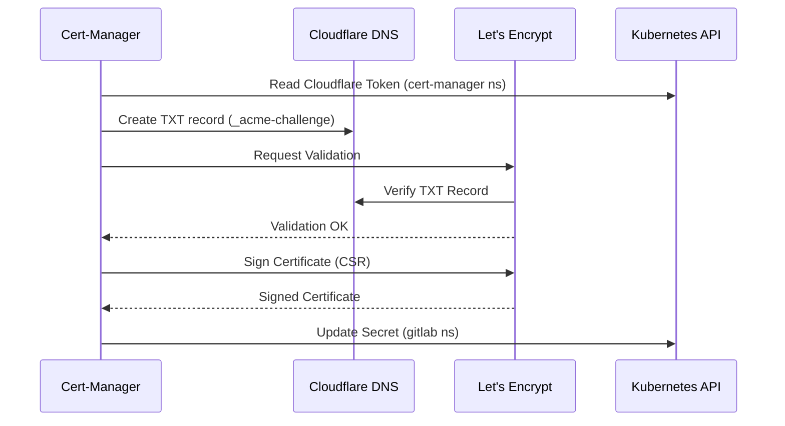

# Certificate Management & PKI

## Description

This document describes the Public Key Infrastructure (PKI) strategy. We utilize
**Cert-Manager** to automate the issuance and renewal of TLS certificates
from **Let's Encrypt**.

## Design Philosophy

The certificate strategy prioritizes **automation** and **privacy**.

* **DNS-01 Validation:** Instead of opening HTTP ports to the internet
  (HTTP-01), we use Cloudflare's API to prove domain ownership. This allows us
  to issue valid certificates for internal-only services or servers behind
  strict firewalls.
* **Wildcard Certificates:** We issue a single wildcard certificate
  (`*.vollbro.se`) to cover all GitLab subdomains
  (`git`, `registry`, `minio`, `kas`).
* **GitOps Integration:** Certificates are defined as Kubernetes manifests
  (`Certificate`), ensuring they are restored automatically during a disaster
  recovery scenario.

## Configuration Schema

| Component           | Setting         | Description                                                |
| :---                | :---            | :---                                                       |
| **Issuer Type**     | `ClusterIssuer` | Global issuer available to all namespaces.                 |
| **Solver**          | `DNS01`         | Uses Cloudflare API Token.                                 |
| **Environment**     | `Production`    | Uses Let's Encrypt Production environment.                 |
| **Secret Location** | `cert-manager`  | The API Token must reside in the `cert-manager` namespace. |

## Decoupled Issuance

To resolve race conditions between Ingress controllers and Cert-Manager, we
utilize a decoupled approach:

1. **Certificate Resource:** A manual `Certificate` object requests
   `*.vollbro.se` and stores it in a Secret (`gitlab-wildcard-tls-v2`).
2. **Ingress Resource:** The Ingress is configured to *use*
   `gitlab-wildcard-tls-v2`, but is *not* annotated to request a new certificate
   itself.
3. **Result:** Nginx simply loads the existing secret, avoiding conflicts or
   "Fake Certificate" issues during bootstrap.

## Visualization

## Transparency Note

The architecture and implementation detailed in this repository are 100% manual
and self-hosted. However, AI tools have been leveraged to refine the
documentation's structure and language to ensure readability.
