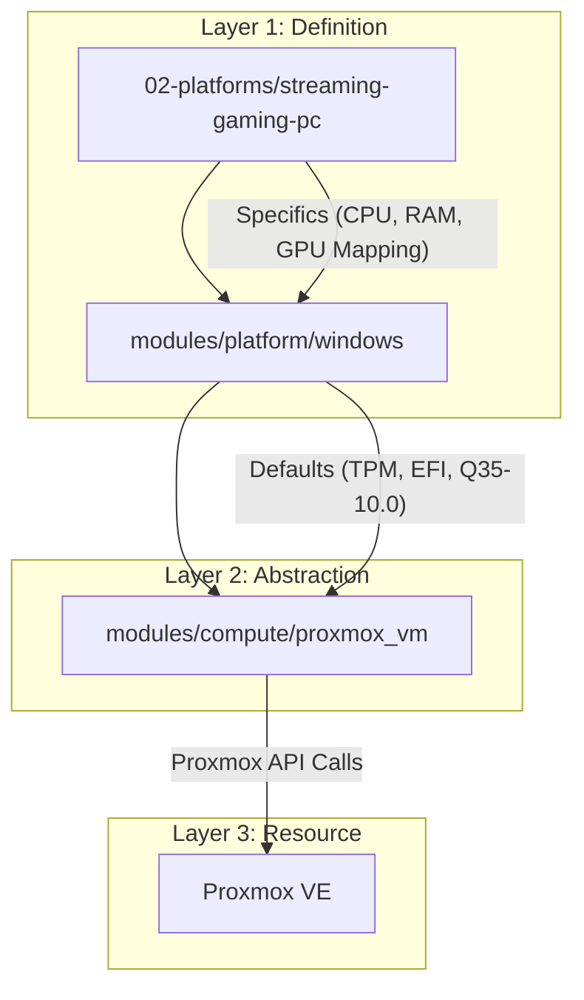

# Cloud Gaming & Remote Workstation Architecture

## Overview
This document details the architecture of the "Streaming Gaming PC"
(`gaming-pc`), a high-performance Windows 11 VM serving as both a primary
engineering workstation and a gaming rig.

Unlike traditional VDI, this setup leverages **PCIe Passthrough** and
**Low-Latency Streaming Protocols** (Artemist/Apollo) to deliver a "native"
experience to thin clients over the network.

## Hardware & Passthrough Strategy

The VM resides on the physical host **srv02** to utilize specific hardware
capabilities.

| Resource    | Configuration                 | Purpose                          |
| :---------- | :---------------------------- | :------------------------------- |
| **Compute** | 8 Cores (Host CPU), 32GB RAM  | Engineering & Gaming Workloads   |
| **GPU**     | NVIDIA RTX 3070 (Passthrough) | 3D Acceleration & NVENC Encoding |
| **Storage** | 200GB System + 500GB Games    | High IOPS via VirtIO SCSI        |

### Performance Tuning (Terraform)
To minimize latency and maximize disk throughput, specific KVM tunings are
applied via Infrastructure as Code:

* **CPU:** `type = "host"` passes the raw CPU instructions to the guest.
* **Memory:** `ballooning = false` ensures the RAM is pinned and dedicated,
preventing swap-induced stutter.
* **Disk I/O:** `aio = "io_uring"` and `cache = "none"` are used to bypass the
host page cache, letting ZFS handle data integrity directly.

## Infrastructure as Code Implementation

The VM is provisioned using a **3-Layer Module Pattern** to ensure consistency
and maintainability.

### The "Error 43" Fix

To prevent the NVIDIA driver from detecting virtualization (and stopping
execution with Code 43), the platform module automatically configures the
correct machine type (`pc-q35-10.0`) and hides the KVM signature.

## Streaming Protocol (Artemis/Apollo)

The connection between the Thin Client and the Host is handled by the
Artemist/Apollo protocol stack.

* **Host:** Windows 11 running Apollo (captures video directly from GPU frame
buffer).
* **Client:** Thin Clients (Laptop, TV) running Artemist (hardware decodes
HEVC stream).

## State Management

Unlike the immutable Kubernetes nodes, this VM is **Stateful**.

* **Backup Strategy:** Daily snapshots.
* **Lifecycle:** Managed via `terraform import` to preserve disk state while
managing hardware configuration as code.

## Transparency Note

The architecture and implementation detailed in this repository are 100% manual
and self-hosted. However, AI tools have been leveraged to refine the
documentation's structure and language to ensure readability.
